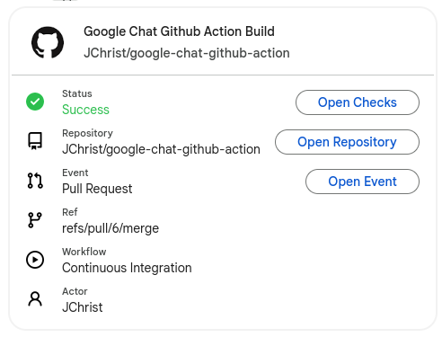
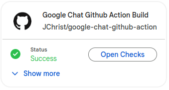
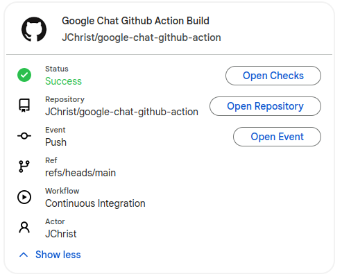

# Google Chat GitHub Action

[](https://github.com/jchrist/google-chat-action)


Send a notification to Google Chat with the result of a GitHub Action, using Cards V2

## Preview

Default (non-collapsible):



Collapsed:



Expanded:



## Example

```yaml
- name: Google Chat Notification
  uses: jchrist/google-chat-github-action@v1
  with:
    name: Build
    url: ${{ secrets.GOOGLE_CHAT_WEBHOOK }}
    status: ${{ job.status }}
  if: always()
  # this allows the build to succeed even when the notification fails
  # e.g. due to dependabot push, which may not have the secret
  continue-on-error: true
```

## Usage

```yaml
- name: Google Chat Notification
  uses: jchrist/google-chat-github-action@v1
  with:
    # The name of the job. Used in the card title
    # Required
    name: Build
    # Google Chat Webhook URL
    # Required
    url: ${{ secrets.GOOGLE_CHAT_WEBHOOK }}
    # Job status. It may be one of `success`, `failure`, `cancelled`. 
    # It's recommended to be set as: `${{ job.status }}`
    # Required
    status: ${{ job.status }}
    # The number of widgets in the card section that are not collapsible
    # Defaults to -1: card is not collapsible.
    # Valid values:
    #   *no value/omitted*: the default value
    #  `number`: the number of widgets that are not collapsible. If negative, the card is not collapsible.
    # Optional
    collapse: 1
  if: always()
  # this allows the build to succeed even when the notification fails
  # e.g. due to dependabot push, which may not have the secret
  continue-on-error: true
```
